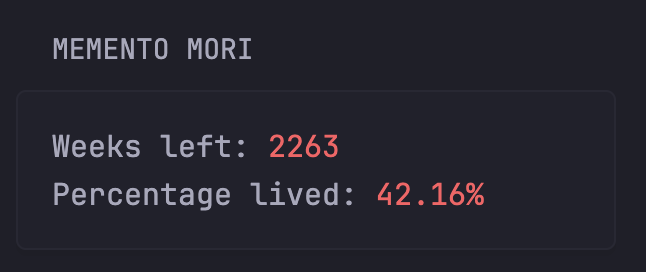

# Memento Mori API

A small FastAPI service that estimates how many weeks remain in a person's expected lifespan and what percentage of that lifespan has elapsed.

## Features

- `POST /life-stats` endpoint with validated request and response models.
- Timezone-aware date calculations. The service reads `TZ` and defaults to `Europe/Berlin` if it is unset or invalid.
- FastAPI's automatically generated interactive docs at `http://localhost:8000/docs` and OpenAPI schema at `http://localhost:8000/openapi.json` when the service is running.
- Docker image and Docker Compose examples.

## Run locally

Requires Python 3.12 or later and [uv](https://docs.astral.sh/uv/).

```sh
uv sync
uv run uvicorn memento_mori_api.main:app --reload
```

The API is available at <http://localhost:8000>. Set `TZ` to use a different timezone:

```sh
TZ=America/New_York uv run uvicorn memento_mori_api.main:app --reload
```

## API

### `POST /life-stats`

Request body:

```json
{
  "birthday": "1990-01-01",
  "life_expectancy": 80
}
```

Choose `life_expectancy` in years. Estimates can be looked up online by country and birth year. For example, [Population Pyramids' life expectancy by country](https://www.populationpyramids.org/life-expectancy-by-country?country=united-states&birthYear=1990&sex=total) provides estimates by country, birth year, and sex.

Response body:

```json
{
  "weeks_left": 2300,
  "percentage_lived": 45.0
}
```

Response values are illustrative and vary with the date and timezone when the request is processed. `weeks_left` is a non-negative integer; `percentage_lived` is rounded to two decimal places and capped at 100.

Example request:

```sh
curl --request POST http://localhost:8000/life-stats \
  --header 'Content-Type: application/json' \
  --data '{"birthday":"1990-01-01","life_expectancy":80}'
```

FastAPI returns `422 Unprocessable Entity` if the request does not match the expected schema. Open <http://localhost:8000/docs> for the interactive API explorer.

## Run with Docker

Build and run the image locally:

```sh
docker build -t memento-mori-api:local .
docker run --rm -p 8000:8000 -e TZ=Europe/Berlin memento-mori-api:local
```

The container uses `uv` to sync the locked project dependencies and start Uvicorn.

## Run with Docker Compose

The included `docker-compose.yaml` runs the GHCR image `ghcr.io/divin/memento-mori:latest`:

```sh
docker compose pull
docker compose up -d
```

Compose passes the host's `TZ` environment variable into the container. If it is not set, the service uses `Europe/Berlin`:

```sh
TZ=America/New_York docker compose up -d
```

To check logs or stop the service:

```sh
docker compose logs -f memento-mori-api
docker compose down
```

## Glance dashboard

This API can be displayed in a [Glance](https://github.com/glanceapp/glance) dashboard using its `custom-api` widget:



Example widget configuration:

```yaml
- type: custom-api
  title: Memento Mori
  cache: 1d
  url: http://memento-mori-api:8000/life-stats
  method: POST
  body-type: json
  body:
    birthday: "1990-01-01" # Example date; replace with your birthday.
    life_expectancy: 75
  headers:
    Content-Type: application/json
  template: |
    <div class="size-h3">
      Weeks left: <span class="color-negative">{{ .JSON.Int "weeks_left" }}</span><br>
      Percentage lived: <span class="color-negative">{{ .JSON.Float "percentage_lived" | printf "%.2f" }}%</span>
    </div>
```

The example uses the Compose service name `memento-mori-api` as the hostname. Glance must be able to reach the API over the network; use the API's service name or network alias in the URL for your deployment.

## Calculation notes

The service estimates age using 365.25 days per year and converts life expectancy to weeks using 52.1775 weeks per year. These are approximations, not a prediction of an individual's lifespan.
